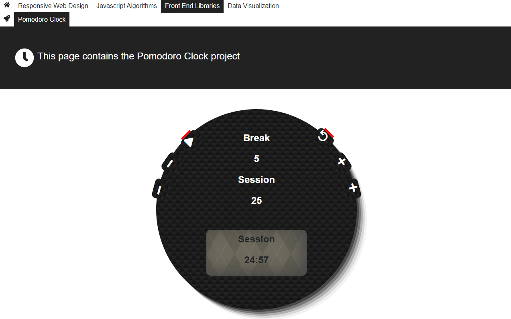

# Expense tracker created with the MERN (MongoDB-Express-React-Node) Stack

> The website is not finished and its purpose is to move all the webapp I created will following the Freecodecamp modules. The web app is created with React and Redux using the `create-react-app`.

> I decided to build this webiste so I can showcase all the projects that I created while getting the Freecodecamp diplomas for Responsive Web Design, Javascript Algorithms, Front End Libraries, and Data Visualization.

## Potential future features

I still need to add the following projects that I developed using codepen.io (please check them out):
  - [React Redux Calculator](https://codepen.io/crisDevMM/full/ZjqKza)
  - [React Redux Markdown Previewer](https://codepen.io/crisDevMM/full/pZJQXR)
  - [Portofolio](https://codepen.io/crisDevMM/full/PaVEXW)
  - [Technical documentation page](https://codepen.io/crisDevMM/full/VdgvXE)
  - [Twitch streamers using the twitch api](https://codepen.io/crisDevMM/full/jaYKXP)
  - [Wikipedia viewer using the Wikipedia api](https://codepen.io/crisDevMM/full/LzRpEW)
  - [Tribute page](https://codepen.io/crisDevMM/full/ayPwab)

## Built With

- React,
- Redux,
- Html,
- Css,
- jquery,
- Api

To get a local copy up and running follow these simple example steps.

### Setup

Clone the project locally and run `npm install` in both project and client directories.

## Available Scripts

In the project directory, you can run:

### `npm start`

Local:            http://localhost:3000/(http://localhost:3000)
On Your Network:  http://192.168.56.1:3000/(http://192.168.56.1:3000/)

The page will reload if you make edits and will sync with other connected devices. 
You will also see any lint errors in the console.

### `npm run build` from the client folder

Builds the app for production to the `build` folder. 
It correctly bundles React in production mode and optimizes the build for the best performance.

The build is minified and the filenames include the hashes. 
Your app is ready to be deployed!

See the section about [deployment](https://facebook.github.io/create-react-app/docs/deployment) for more information.

### `npm run eject` from the client folder

**Note: this is a one-way operation. Once you `eject`, you can’t go back!**

If you aren’t satisfied with the build tool and configuration choices, you can `eject` at any time. This command will remove the single build dependency from your project.

Instead, it will copy all the configuration files and the transitive dependencies (webpack, Babel, ESLint, etc) right into your project so you have full control over them. All of the commands except `eject` will still work, but they will point to the copied scripts so you can tweak them. At this point you’re on your own.

You don’t have to ever use `eject`. The curated feature set is suitable for small and middle deployments, and you shouldn’t feel obligated to use this feature. However we understand that this tool wouldn’t be useful if you couldn’t customize it when you are ready for it.

## Authors

👤 **Cristian Viorel Ceamatu**

- Github: [@githubhandle](https://github.com/cristianCeamatu)
- Twitter: [@twitterhandle](https://twitter.com/CeamatuV)
- Linkedin: [linkedin](https://www.linkedin.com/in/ceamatu-cristian-viorel-7a5469136/)

## Show your support

Give a ⭐️ if you like this project!

## 📝 License

This project is [MIT](lic.url) licensed.
